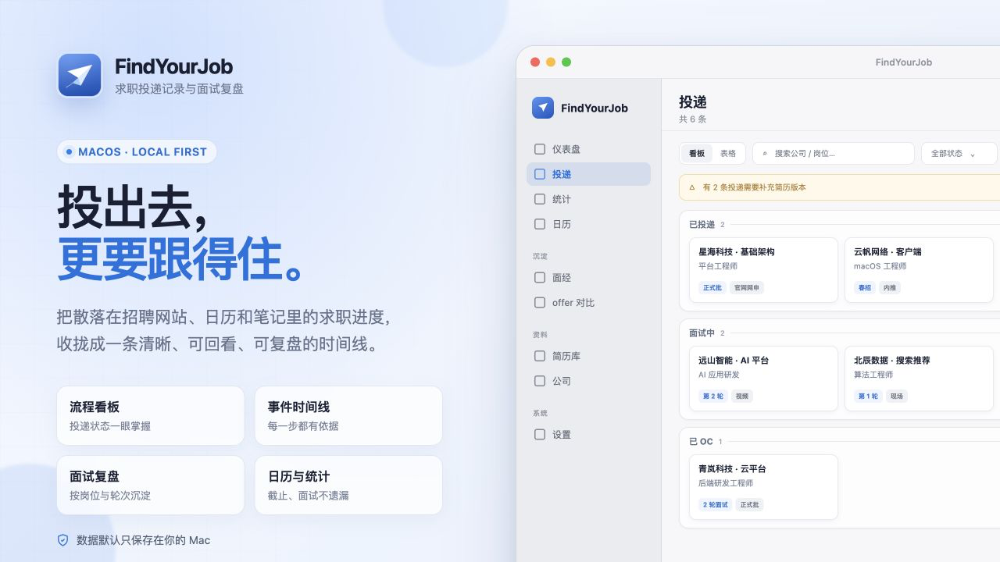

<p align="center">
  
</p>

<h1 align="center">FindYourJob</h1>

<p align="center">
  为 macOS 打造的本地求职投递记录与面试复盘工具。
  <br />
  把投递、流程事件、面试、截止日期和复盘资料收拢到一个清晰的工作台。
</p>

<p align="center">
  <a href="https://github.com/whyluna/find-your-job/releases/download/v0.1.0/FindYourJob_0.1.0_aarch64.dmg">下载 v0.1.0（Apple Silicon）</a>
  ·
  <a href="docs/design.md">设计文档</a>
  ·
  <a href="docs/acceptance/">验收记录</a>
</p>



> 介绍图由 [HTML/CSS 源文件](docs/app-intro.html) 渲染生成，使用的是虚构示例数据。

## 适合这些场景

- **同时跟进多家公司**：用看板或表格集中查看当前阶段、批次、渠道、岗位和下一步安排。
- **校招流程节点多**：统一记录测评、笔试、多轮面试、OC、意向书、offer 和签约，不再依赖零散表格。
- **面试后及时复盘**：按公司、岗位和轮次沉淀题目、自己的回答、理想回答、表现与知识点标签。
- **担心错过截止和面试**：在仪表盘查看近期待办，在日历中统一查看投递日、截止日期与面试安排。
- **需要比较多个机会**：用可调权重对薪资、成长、城市、工作生活平衡和稳定性进行横向比较。
- **希望数据留在本机**：核心数据保存在本地 SQLite，可随时导出 JSON 备份或使用 CSV 迁移。

## 功能

### 投递跟踪

- 看板与表格双视图，支持搜索、状态筛选和拖拽排序。
- 跨状态拖拽时提供明确目标反馈；状态变更通过事件确认，避免误操作。
- 状态由时间线事件与面试记录推导，补录、删除或改判后会自动重新计算。
- 支持批次、渠道、Base、部门、优先级、标签、薪资范围和归档。

### 时间线与面试

- 在投递详情中统一添加投递、测评、笔试、HR 沟通、OC、offer、签约等事件。
- 面试按轮次记录时间、形式、地点或链接、时长和结果。
- 每轮可继续记录题目、自己的回答、理想回答、回答质量和知识点标签。
- 面经页按岗位与轮次聚合全部题目，便于复习和检索。

### 日历、统计与决策

- 月历统一展示面试、流程截止日期和投递记录。
- 仪表盘聚合近期截止与面试安排。
- 统计页提供阶段漏斗、近 8 周投递趋势、渠道/批次分布和沉默投递。
- offer 对比支持五维加权评分，权重和评分均保存在本机。

### 资料与收录

- 保存 JD 快照，避免招聘链接失效后无法回看岗位要求。
- 简历库管理不同岗位方向的文件版本，并可为投递标记实际使用的版本。
- 支持投递附件、公司资料与招聘官网维护。
- 可选浏览器扩展支持从 Boss 直聘、牛客、猎聘、实习僧及带有 JobPosting 数据的招聘页面收录岗位。
- 可选配置 OpenAI 兼容接口，对网页岗位信息进行结构化提取；API Key 只保存在本机，启用后岗位页面内容会发送到你配置的模型服务商。

### 本地数据

- 数据库存放于：
  `~/Library/Application Support/com.findyourjob/findyourjob.db`
- JSON 全量导出与覆盖式恢复会包含数据库记录和受管文件。
- 支持 CSV 导入导出，便于与表格工具互通。
- 浏览器扩展仅通过带 Token 的本机 `127.0.0.1` 接口与 App 通信。

## 安装

### 下载 DMG

1. 下载 [FindYourJob_0.1.0_aarch64.dmg](https://github.com/whyluna/find-your-job/releases/download/v0.1.0/FindYourJob_0.1.0_aarch64.dmg)。
2. 打开 DMG，将 FindYourJob 拖入“应用程序”。
3. 当前版本为本地签名、尚未经过 Apple 公证；首次启动如被 Gatekeeper 阻止，请在 Finder 中右键 App 并选择“打开”。

当前发布包面向 Apple Silicon Mac。

### 从源码构建

需要 Node.js 22+、pnpm 与 Rust：

```bash
pnpm install
pnpm tauri build
```

项目中的构建脚本会自动：

1. 构建 App 与 DMG；
2. 替换 `/Applications/FindYourJob.app`；
3. 校验安装结果；
4. 删除 `src-tauri/target/release/bundle/macos` 下的 App 副本。

## 浏览器扩展

### 下载与安装

1. 从 [v0.1.0 Release](https://github.com/whyluna/find-your-job/releases/tag/v0.1.0) 下载 `FindYourJob-browser-extension-v0.1.0.zip`。
2. 将 ZIP 解压到一个固定目录。浏览器会持续读取这个目录，加载后不要移动或删除。
3. 打开扩展管理页：
   - Chrome：`chrome://extensions`
   - Edge：`edge://extensions`
4. 开启“开发者模式”，点击“加载已解压的扩展程序”。
5. 选择解压后包含 `manifest.json` 的目录，并将“FindYourJob 收录”固定到工具栏。

### 与 App 联动

1. 启动 FindYourJob App。
2. 打开“设置 → 浏览器扩展接入”，勾选开启，确认状态显示“服务运行中”。
3. 点击 Token 右侧的“复制”。
4. 首次打开“FindYourJob 收录”扩展，将 Token 粘贴进去并点击“保存 Token”。
5. 打开招聘岗位页面，再点击扩展图标：
   - 插件会先在浏览器本地识别公司、岗位、Base、渠道和 JD；
   - 所有字段都可以在收录前手动修改；
   - 如已在 App 中配置智能识别，可按需点击“AI 识别”进行公司/岗位识别和 JD 清洗；
   - 点击“确认收录”。
6. 出现“已收录到 FindYourJob（已保存状态）”后，岗位会进入 App 的投递看板；之后可补充批次、简历版本并通过时间线记录正式投递。

也可以在岗位页面使用右键菜单“收录到 FindYourJob”快速保存。工具栏角标显示 `✓` 表示成功，`T` 表示尚未配置 Token，`×` 表示连接或保存失败。

如果插件提示无法连接，请确认 App 正在运行且“浏览器扩展接入”已经开启。如果提示 Token 无效，请在 App 中重置 Token，并在扩展的“修改 Token”中同步更新。

普通收录只通过 `127.0.0.1` 与本机 App 通信；使用可选的 AI 识别时，岗位页面内容会发送到你在 App 中配置的模型服务商。

### 从源码构建

```bash
cd apps/extension
pnpm install
pnpm build
```

构建完成后，在 Chrome 或 Edge 的扩展管理页加载：

```text
apps/extension/build/chrome-mv3
```

## 开发

```bash
pnpm dev              # Vite 前端
pnpm tauri dev        # Tauri 开发模式
pnpm typecheck        # TypeScript 类型检查
pnpm test             # Vitest
cd src-tauri
cargo test --workspace
```

技术栈：

- Tauri 2
- React 19 + TypeScript
- Rust + sqlx + SQLite
- dnd-kit
- Recharts
- WXT 浏览器扩展

领域逻辑集中在 `src-tauri/crates/core`，Tauri 命令层保持轻量。

## 项目结构

```text
apps/extension/             浏览器扩展
docs/                       设计文档、验收记录与介绍图
packages/shared/            前后端共享类型和枚举
src/                        React 前端
src-tauri/                  Tauri 与 Rust 领域服务
scripts/                    构建、安装、图标与备份脚本
```
